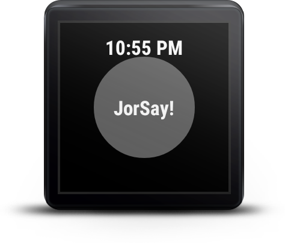

##JorSay
With this app, user's phone would read notifications aloud when user signals it to, by shaking her (Android Wear - wearing) wrist.

####What does JorSay address?
Wearables today are not big on hands-free interaction. Reading a notification and taking an action on it all requires use of the other hand - and as both hands get engaged, the benefit of the 'second screen' on user's wrist exponentially diminishes. Moreover, the user could be driving, washing her hands, holding something etc., making two-handed usage impractical.

#####Jorsay creates this alternative flow:
1. User receives the notification
2. Android Wear device on user's wrist vibrates.
3. User understands that a notification is received, shakes her wrist.
4. On this signal, the phone reads the notification aloud. This eliminates the need of fumbling with the Android Wear device or the phone.

####Screenshots
#####Mobile

#####Wear

#####Wear, Ambient Mode

